## Introduction

This repository is mainly for JavaScript automated testing of OpenSpace. The technology stack used is Seleniumjs and Cucumber. The purpose is to simulate various operations when users browse the web, and it is expected that the functions of the web page can operate normally and give back a positive user experience to the user. Cucumber is a BDD test framework. The main purpose of using Cucumber is to make the test content simple and easy to understand, so that people in different positions on the team can communicate and improve the test.

## Architecture

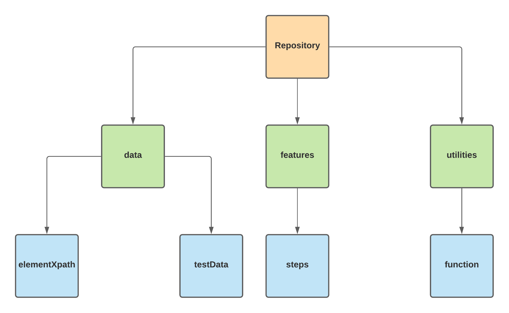

data: Folder to store elements and test data e.g user account and password.  
elementXpath: File to store elements by Xpath.  
testData: File to store input data for testing.  
steps: Folder to store .feature files.  
function: File to store reusable functions

## Test Report

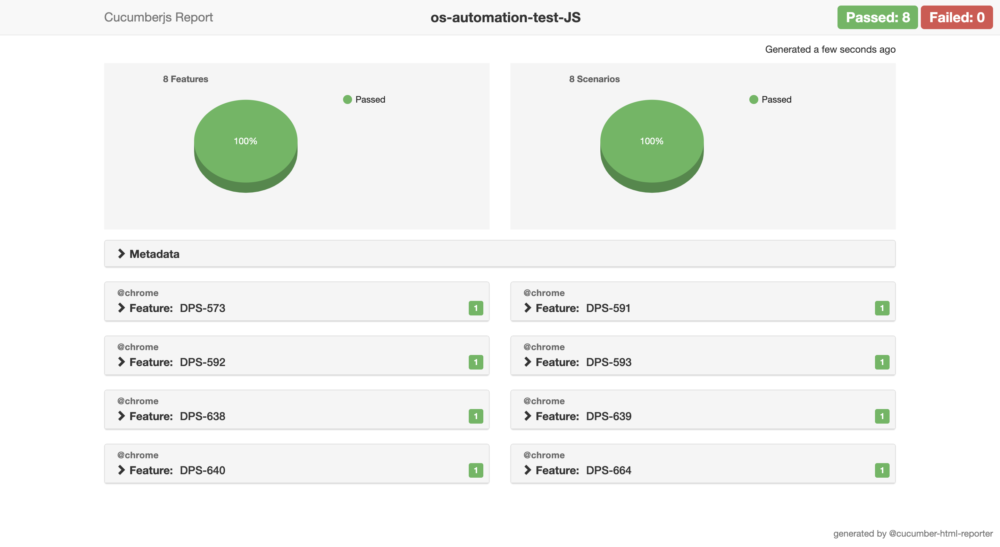

## Test Cases

DPS-573:Verifying support and profile menu in top navigation.  
DPS-577:Verifying support centre.  
DPS-579:Verifying my profile and enrolment page.  
DPS-581:Verifying assessment support page.  
DPS-583:Verifying study buddy page.  
DPS-588:Verifying students grades page.  
DPS-589:Verifying payment page.  
DPS-590:Verifying FAQ main page and FAQ feedback.  
DPS-591:Verifying user can post image and text into discussion panel.  
DPS-592:Verifying discussion likes, dislikes, replies and url content.  
DPS-593:Verifying the number of discussion posts.  
DPS-638:Verifying megadrop menu options.  
DPS-639:Verifying megadrop menu and subtopic navigation.  
DPS-640:Verifying megadrop menu and activities.  
DPS-642:Verifying megadrop menu and search links.  
DPS-658:Verifying last visited page link and walkthrough.  
DPS-659:Verifying download assessment.  
DPS-664:Verifying trainer tooltip in discussion panel.  
DPS-802:Verifying assessor home page.  
DPS-803:Verifying assessor messaging.  
DPS-942:Verifying search bar in support centre page.

## Prerequisites

Nodejs: https://nodejs.org/en/download/

## Installation

Selenium: npm install selenium-webdriver --save-dev  
Cucumberjs: npm install cucumber-js --save-dev  
Chromedriver: brew install chromedriver --cask  
(Install latest chromedriver from terminal root (~/))  
Cucumber report: npm install cucumber-html-reporter --save-dev

## Test Executing:

Test a single test case: Test a single test case: npm run single -testFile=DPS-573  
(Run test case DPS-573.feature)

Test all test cases: npm run test all

Show test report: npm run report

## Common Errors and Solutions:

Element click interception  
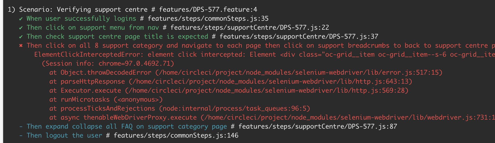
https://stackoverflow.com/questions/56779520/elementclickinterceptedexception-element-click-intercepted

Element is not attached to the document page  
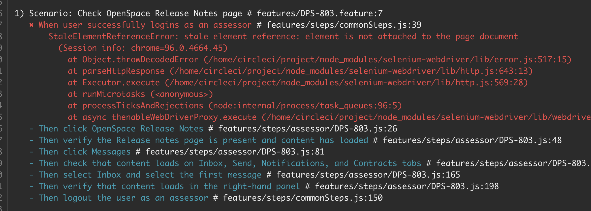
https://stackoverflow.com/questions/67205623/selenium-element-is-not-attached-to-the-page-document-in-selenium-java

Element is not clickable at point (X,Y)  

https://stackoverflow.com/questions/37879010/selenium-debugging-element-is-not-clickable-at-point-x-y/37880313#37880313

Element not interactable  
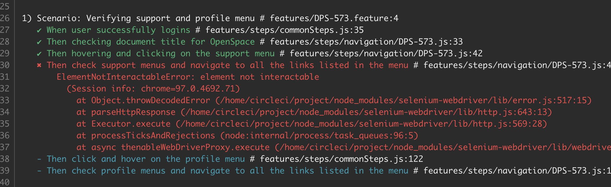
https://stackoverflow.com/questions/45183797/element-not-interactable-exception-in-selenium-web-automation

Function timed out  
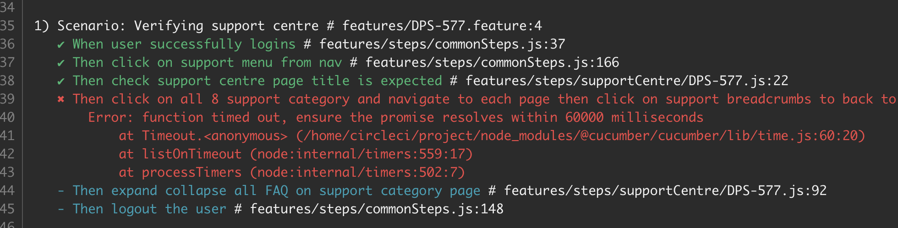
https://stackoverflow.com/questions/51965579/webdriverio-cucumber-function-timeout-ensure-promise-resolves-within-10000

Invalid session Id  
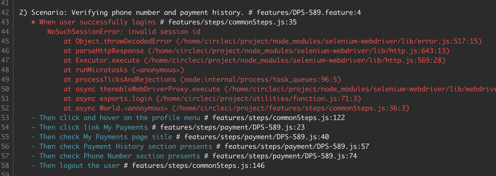
https://stackoverflow.com/questions/56483403/selenium-common-exceptions-webdriverexception-message-invalid-session-id-using

Version Error  
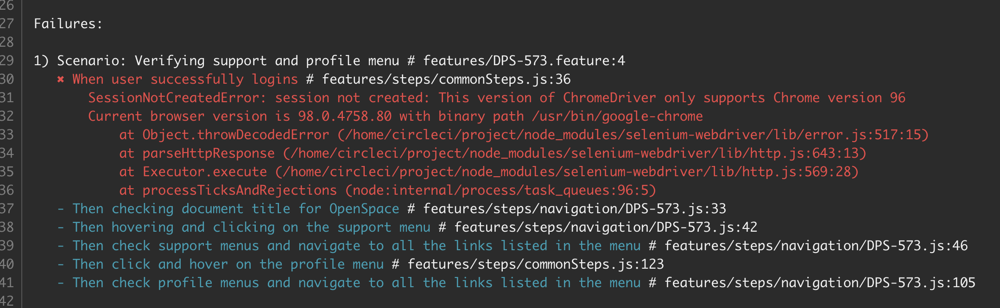
brew install chromedriver --cask

Assertion Error  
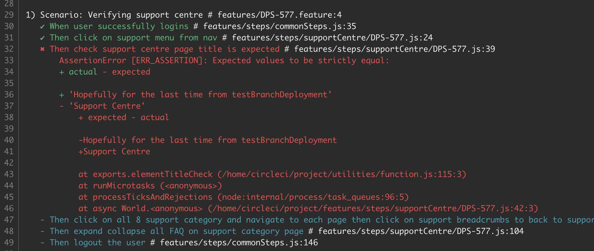

Cant Find Module  
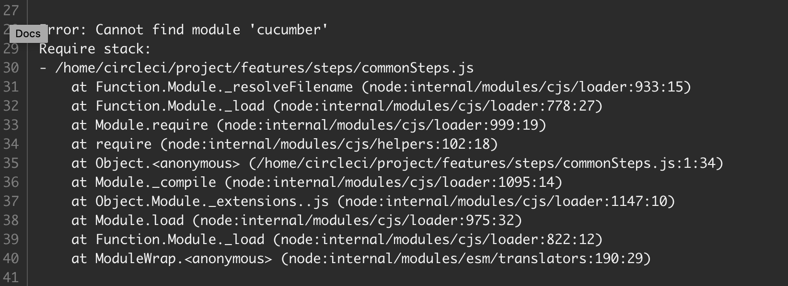

Waiting For Element To Be Located  
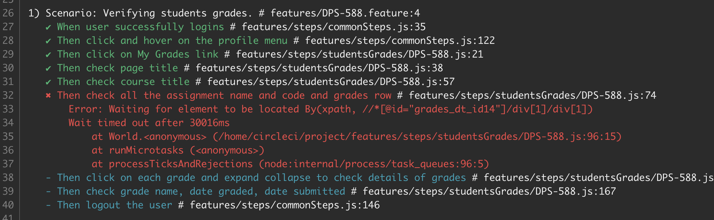

## Resources

Selenium Docs:
https://www.selenium.dev/selenium/docs/api/javascript/module/selenium-webdriver/ie_exports_Driver.html#findElement

Selenium Webdriver:
https://www.selenium.dev/documentation/

Gherkin Syntax:
https://cucumber.io/docs/gherkin/reference/

Cucumber Docs:
https://github.com/cucumber/cucumber-js

Cucumber Tutorial:
https://cucumber.io/docs/guides/10-minute-tutorial/

Cucumber reporting:
https://www.npmjs.com/package/cucumber-html-reporter

Selenium Exception Handling:
https://www.guru99.com/exception-handling-selenium.html

## Udemy Courses

WebDriverIO + Javascript  
https://www.udemy.com/course/webdriverio-tutorial-nodejs-javascript/learn/lecture/25734250?start=15#overview

## Contact

Kyrie Wen - kyrie.wen@opencolleges.edu.au
